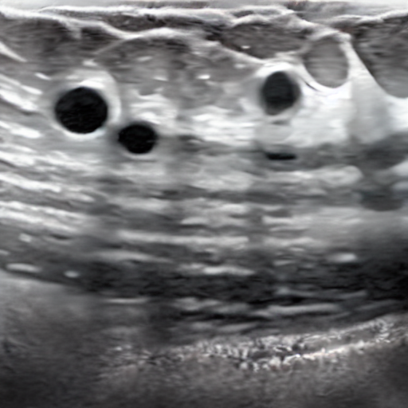
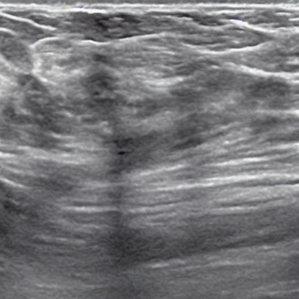
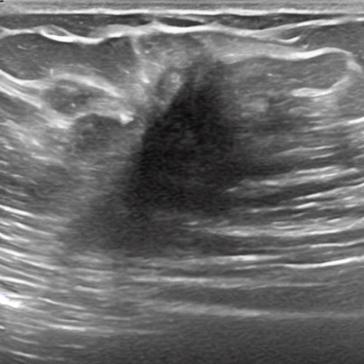
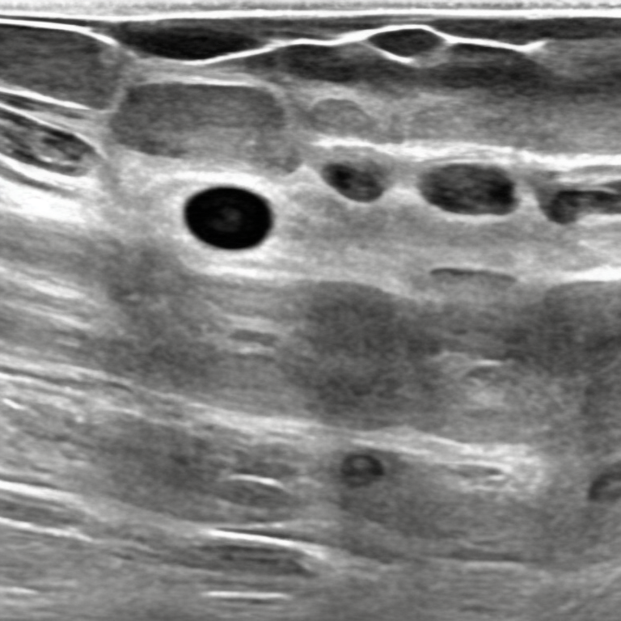
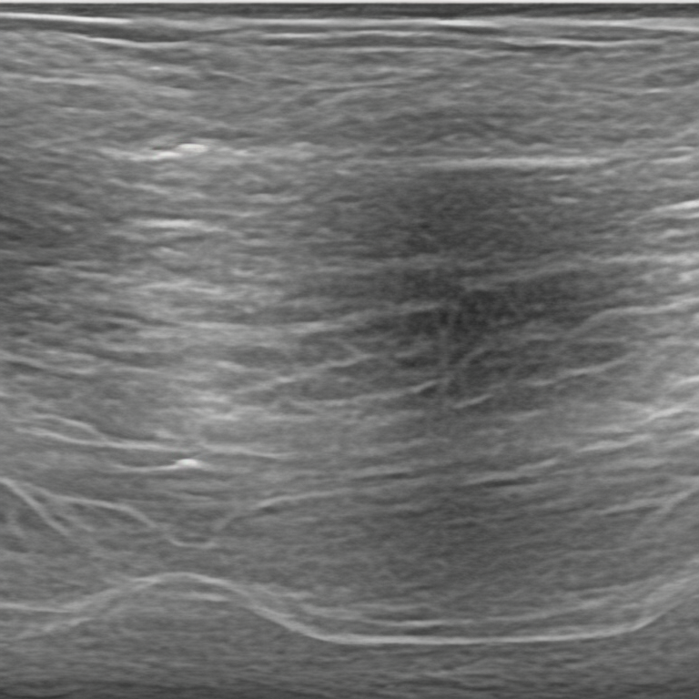
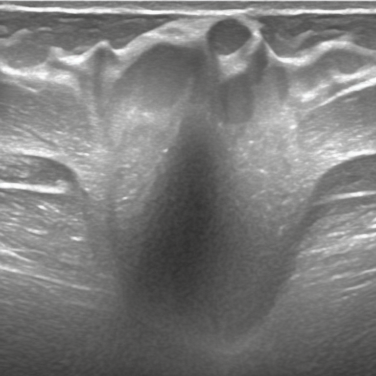

# LLM bio hackathon (Ultrasound image simulator)

## Some examples for the generated ultrasound images


### `stable-diffusion-v1` with prompt '*a ultrasound image of breast with two small  benign tumor*'



### `stable-diffusion-v1` with prompt '*a ultrasound image of normal breast*'



### `stable-diffusion-v1` with prompt '*a ultrasound image of breast with a malignant tumor with unclear boundary*'



### `stable-diffusion-v2` with prompt '*a ultrasound image of breast with two small  benign tumor*'



### `stable-diffusion-v2` with prompt '*a ultrasound image of normal breast*'



### `stable-diffusion-v2` with prompt '*a ultrasound image of breast with a malignant tumor with unclear boundary*'


## WebApp

We use Gradio to crate a small webapp to do generation

```
python inference_img2img_gradio.py
```

Through this interface at 127.0.0.1:7860, you can upload an image along with a prompt and a negative prompt. It will generate four images with four seeds. We have found that using the prompt 'ultrasound image with a malignant tumor' and the negative prompt 'ultrasound scanning device' yields good results.

## Example of generation with one sample
An example of how to do generation using the web app. The following example inputs malignant carcinogen-related tumor markers in an input image with four different initialization seeds. This gives four potential ways that cancer may appear in the same tissue.

https://github.com/Aniloid2/LLM_bio_hackathon/assets/17166325/13a71d33-598b-4810-aff1-b3f40a29bd5e


## Highlighting the Significance of the Image Guidance Feature
Other generation methods are text-to-image only, allowing comparison between a normal tissue scan and a randomly generated cancer image. Using image+text prompting allows inputting disease markers within the same input image, allowing for a real one to one comparison between normal tissue and the hypothetical same tissue with cancerogeneous disease markers.

https://github.com/Aniloid2/LLM_bio_hackathon/assets/17166325/e7b08d67-5330-4e3a-a1df-5ebedae9522b

## Python environment configuration

Install `conda` on linux with command
```
wget https://repo.anaconda.com/archive/Anaconda3-2023.07-1-Linux-x86_64.sh
```
or the latest version from https://www.anaconda.com/download#downloads for your particular machine.
Then do:
```
bash Anaconda3-2023.07-1-Linux-x86_64.sh
```

Now create a conda enviroment with name `ultrasound`
```
conda env create -f environment.yml
```
Finally, activate the environment by
```
conda activate ultrasound
```


## Data preparation

The data that we use to fine-tune is the [Breast Ultrasound Images Dataset](https://www.kaggle.com/datasets/aryashah2k/breast-ultrasound-images-dataset), which contains 780 images with size 500*500.
The images are categorized into three classes, which are normal, benign, and malignant.
One can download the dataset from the link 
https://www.kaggle.com/datasets/aryashah2k/breast-ultrasound-images-dataset.
The images will be stored in the folder `Dataset_BUSI_with_GT`.


## Data processing

After downloading the ultrasound dataset, create a folder `ultrasound` to store all the ultrasound images that exclude the **mask**.
Then create three folders `benign`, `malignant` and `normal` to store the corresponded class of images.


This can be done by runing 
```
python data_loading.py
```

Remember to change the `source_dir` and `destination_dir` for different classes in the `data.py`.
Finally, this will remove the mask images from the classes and copy the images into the `ultrasound` folder.
The dataset and environment are now ready!


## Fine-tuning

The training pipeline is mainly based on https://huggingface.co/docs/diffusers/v0.11.0/en/training/dreambooth.

Specifically, we use the stable-diffusion models for fine-tuning
based on two methods: `DreamBooth`, `DreamBooth with LORA`.
For each method, we fine-tune in two classes of stable-diffusion models:
`stable-diffusion-v1`, `stable-diffusion-2`.

The fine-tuning process follows by the order 
`normal->benign->malignant` with totally 3 ruonds of training.


To run the code, firstly install Diffusers from Github:
```
pip install git+https://github.com/huggingface/diffusers
pip install -U -r diffusers/examples/dreambooth/requirements.txt
```

After all the dependencies have been set up, initialize a Accelerate environment with:
```
accelerate config
```


Then run the following code to fine-tune in a stable-diffusion-v1 model by DreamBooth with LORA method.
```
bash train_lora_v1.sh
```
The saved checkpoints are in the folder `dreambooth_lora_v1`.

For stable-diffusion-v1 model + DreamBooth method, run
```
bash train_v1.sh
```
The saved checkpoints are in the folder `output_models`.

For stable-diffusion-2 model + DreamBooth method, run
```
bash train_v2.sh
```
The saved checkpoints are in the folder `output_models`.

For stable-diffusion-2 model + DreamBooth with LORA method, run
```
bash train_lora_v2.sh
```
The saved checkpoints are in the folder `path_to_saved_model`.


## Inference

For the inference part, we have two kinds of pipelines:
* text -> image
* image + text -> image


After we obtain the checkpoints for the fine-tuned models, we can do inference with a text prompt.
For the stable-diffusion-v1 model + DreamBooth_LORA method, run
```
python inference_text2img_lora_v1.py
```
by changing the prompt to your own text prompt.
The output image will be saved in the folder `saved_images/dreambooth_lora_v1`.

For other text-> image models, run
```
python inference_text2img.py
```
by changing the prompot in the python file with your own text prompt.
The output image will be saved in the folder `saved_images/text2img`.

For the image + text -> image models, run
```
python inference_img2img_v2.py
```
The output image will be saved in the folder `saved_images/img2img`.

 
